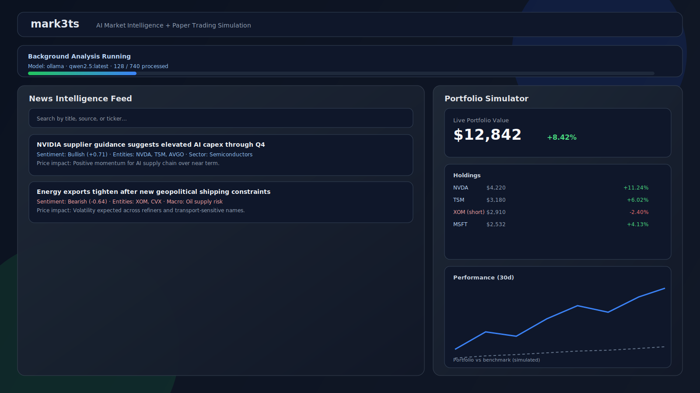

# mark3ts

AI-powered market intelligence and paper-trading simulation platform built for education and research.

This project ingests market news, runs structured LLM analysis, extracts ticker/topic/event signals, and converts those signals into conviction-weighted paper portfolio allocations with live quote updates.

No real-money trading is performed.

## Why This Project Is Strong For Employers

- Full-stack architecture with clear separation of frontend UX, backend orchestration, and data pipelines.
- Practical AI integration with resilient provider fallback, schema-constrained output handling, and persisted analysis artifacts.
- Real-world systems work: asynchronous maintenance jobs, retention and archival policies, background processing controls, and operational webhook support.
- Product-oriented implementation with measurable user workflows from ingestion to analysis to simulation outcomes.

## Product Screenshot

Sample UI preview:



## Core Features

### Completed

- News ingestion from RSS and manual submission.
- Two-pass AI analysis pipeline (fast pass plus deep pass selection).
- Structured extraction of entities, sentiment, sector tags, macro signals, and signal facts.
- Conviction-weighted signal aggregation for ticker-level allocation logic.
- Paper portfolio simulator with long and short positions.
- Live quote valuation updates using Finnhub.
- Background analyze-all workflow with progress bar plus pause, resume, and stop controls.
- Importance scoring, retention caps, pruning, and archival support.
- Finnhub webhook endpoint with secret validation and fast acknowledgment.

### In Progress

- Long-horizon topic and event knowledge base built from extracted signal facts.
- Advanced model-ready feature export pipeline for forecasting experiments.
- Additional explainability views for per-ticker conviction components.

## Tech Stack

- Frontend: React, Vite, Tailwind CSS, Recharts, Lucide icons.
- Backend: Node.js, Express.
- AI: Ollama (local-first), optional OpenAI fallback.
- Market Data: Finnhub quotes and historical candles.
- Storage: local JSON entity store with retention and archive strategy.

## High-Level Architecture

1. Ingestion Layer
	 - RSS/manual article capture and persistence.
2. Analysis Layer
	 - LLM analysis with JSON schema guidance.
	 - Fast pass for broad coverage and deep pass for high-value items.
3. Signal Layer
	 - Ticker/topic/event extraction and conviction scoring.
4. Simulation Layer
	 - Allocation generation, live quote refresh, and return tracking.
5. Operations Layer
	 - Background maintenance jobs with run controls and status endpoints.

## Project Structure

```text
mark3ts/
	server/
		index.js            # Express API, maintenance orchestration, price/webhook routes
		llm.js              # LLM provider selection and invocation logic
		newsStore.js        # News persistence, importance scoring, pruning, archival
		priceStore.js       # Finnhub quote/history and tradable symbol validation
		data/
			news.json
			feeds.json
	src/
		pages/
			NewsFeed.jsx              # Ingestion + analysis controls + run progress UI
			PortfolioSimulator.jsx    # Signal-driven paper trading workflows
			HypothesisExplorer.jsx
			Dashboard.jsx
		components/
			news/
			hypothesis/
			simulation/
			dashboard/
			shared/
			ui/
		lib/
			newsSignals.js     # Conviction and allocation logic
		api/
			appClient.js
			localClient.js
	public/
		manifest.json
		sample-screenshot.svg
```

## Local Setup

### Prerequisites

- Node.js 20+
- npm 10+
- Ollama installed and running locally
- Finnhub API key
- ngrok (optional, for webhook testing)

### 1) Install

```bash
npm install
```

### 2) Configure Environment

Create or edit .env with:

```env
# LLM
LLM_PROVIDER=ollama
OLLAMA_BASE_URL=http://127.0.0.1:11434
OLLAMA_MODEL=qwen2.5:latest

# Optional OpenAI fallback
# OPENAI_API_KEY=your_openai_key
# OPENAI_MODEL=gpt-4.1-mini

# Backend
PORT=4000

# Market data
FINNHUB_API_KEY=your_finnhub_key
FINNHUB_WEBHOOK_SECRET=your_webhook_secret

# Analysis scheduler (optional tuning)
NEWS_ANALYSIS_BATCH_LIMIT=1
NEWS_ANALYSIS_MAX_BATCHES=25
NEWS_ANALYSIS_INTERVAL_MS=3600000
```

### 3) Pull and Verify Ollama Model

```bash
ollama pull qwen2.5:latest
```

### 4) Run Backend and Frontend

Terminal A:

```bash
npm run server
```

Terminal B:

```bash
npm run dev
```

Open the app at the URL printed by Vite.

## How To Use

### News Analysis Workflow

1. Add articles in News Feed.
2. Click Analyze this page for page-level analysis or Analyze all unanalyzed (background) for full dataset processing.
3. Monitor progress at the top bar, including provider/model, progress count, and pause/resume/stop controls.

### Simulation Workflow

1. Go to Portfolio Simulator.
2. Choose News Signal Basket mode.
3. Set fake capital and create simulation.
4. Click Update Portfolio Amount to refresh live valuation from Finnhub quotes.

## ngrok + Finnhub Webhook Setup (Local)

1. Start backend locally on port 4000.
2. Run ngrok:

```bash
ngrok http 4000
```

3. In Finnhub webhook settings:
	 - URL: https://your-ngrok-subdomain.ngrok-free.app/api/finnhub/webhook
	 - Secret: same value as FINNHUB_WEBHOOK_SECRET

4. Verify via API:
	 - GET /api/prices/status should show webhook_configured true.

## API Surface (Key Endpoints)

- GET /api/news
- POST /api/news
- PUT /api/news/:id/analysis
- POST /api/news/maintenance/run
- GET /api/news/maintenance/run
- POST /api/news/maintenance/run/pause
- POST /api/news/maintenance/run/resume
- POST /api/news/maintenance/run/stop
- GET /api/prices/status
- GET /api/prices/quotes
- GET /api/prices/history
- POST /api/finnhub/webhook

## Implementation Highlights

- Conviction scoring blends weighted sentiment strength, directional agreement, and sample-size shrinkage.
- Analysis results are normalized and persisted, including structured signal_facts for future model experimentation.
- Maintenance orchestration supports async background jobs and operational controls.
- UI communicates runtime status clearly for long-running analysis tasks.

## Quality Checks

```bash
npm run typecheck
npx eslint src server --quiet
```